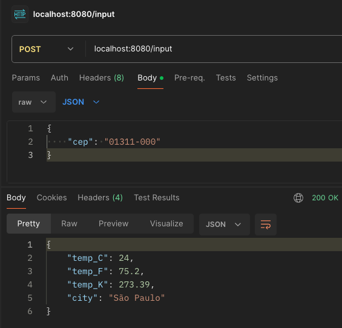
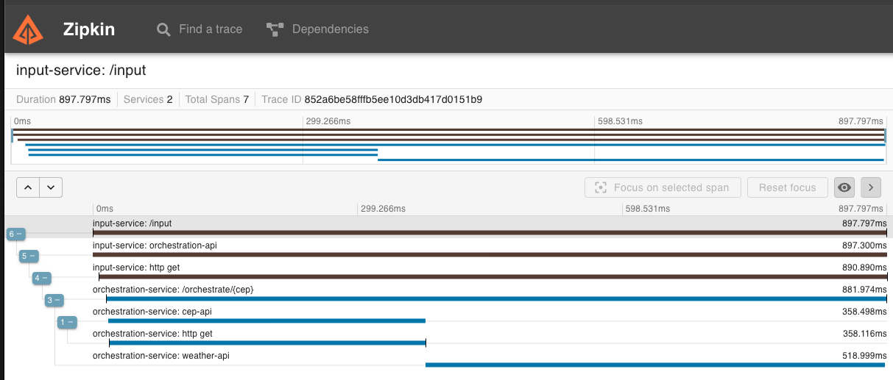

# goexpert-cep2temp-otel 

------
## Challenge description
### Objective
Develop a system in Go that receives a ZIP code, identifies the city and returns the current weather (temperature in degrees celsius, fahrenheit and kelvin) along with the city. This system should implement OTEL(Open Telemetry) and Zipkin.

Based on the known scenario "Temperature system by ZIP code" referred to as Service B, a new project will be included, referred to as Service A.

### Requirements - Service A (Input Responsible)
- The system should receive a 8-digits input via POST, using the schema: `{ "cep": "29902555" }`
- The system should validate whether the input is valid (contains 8 digits) and is a STRING
- If valid, it will be forwarded to Service B via HTTP
- If not valid, it should return:
- HTTP Code: 422
- Message: invalid zipcode

### Requirements - Service B (Orchestration Responsible)
- The system should receive a valid 8-digits ZIP code
- The system should perform a ZIP code search and find the location name, from which it should return the temperatures and format them as: Celsius, Fahrenheit, Kelvin along with the location name.
- The system should respond properly under the following scenarios:
- In case of success:
- HTTP Code: 200
- Response Body: `{ "city": "São Paulo", "temp_C": 28.5, "temp_F": 28.5, "temp_K": 28.5 }`
- In case of failure, if the ZIP code is not valid (but correctly formatted):
- HTTP Code: 422
- Message: invalid zipcode
- In case of failure, if the ZIP code cannot be found:
- HTTP Code: 404
- Message: can not find zipcode

Upon implementation of the services, add the implementation of OTEL + Zipkin:
- Implement distributed tracing between Service A - Service B
- Use span to measure the response time of the ZIP code search service and temperature search service

### Tips
- Use viaCEP API (or similar) to find the location you want to check the temperature: [https://viacep.com.br/](https://viacep.com.br/)
- Use the WeatherAPI (or similar) to check the desired temperatures: [https://www.weatherapi.com/](https://www.weatherapi.com/)
- To convert Celsius to Fahrenheit, use the formula: F = C * 1.8 + 32
- To convert Celsius to Kelvin, use the formula: K = C + 273
- With F = Fahrenheit
- With C = Celsius
- With K = Kelvin
- For doubts regarding OTEL implementation, [click here](https://opentelemetry.io/docs/languages/go/getting-started/)
- To implement spans, [click here](https://opentelemetry.io/docs/languages/go/instrumentation/#creating-spans)
- You will need to use an OTEL collection service [click here for more information](https://opentelemetry.io/docs/collector/quick-start/)
- For more information about Zipkin, [click here](https://zipkin.io/)

### Delivery
- The complete source code of the implementation
- Documentation explaining how to run the project in a development environment
- Use docker/docker-compose so that we can test your application

------ 
## How to run locally

### Using Go
- Clone the repository;
- Open terminal on the project folder;
- Make sure you have otel-collector (port 4317) and zipkin running locally;
- Make sure to add a valid weather API key in the file `configs/config.env`;
- Run `go run cmd/inputapi/main.go` to start the input application;
- Run `go run cmd/orchestrationapi/main.go` to start the orchestration application;

### Using docker-compose
- Clone the repository;
- Make sure to add a valid weather API key in the file `configs/config.env`;
- Open terminal on the project folder;
- Run `docker-compose up --build`;

### How to test
- Make a POST request to `http://localhost:8080/input` with the following body: `{ "cep": "01311-000" }`;

- Open zipkin in `http://localhost:9411/zipkin/` and search for the traces;

- You should be able to see the distributed tracing and the spans from each service;
- It is also possible to use jaeger in `http://localhost:16686/` to see the traces;

### Contact
- [Email](mailto:mateusmatinato@gmail.com)
- [LinkedIN](https://linkedin.com/in/mateusmatinato)